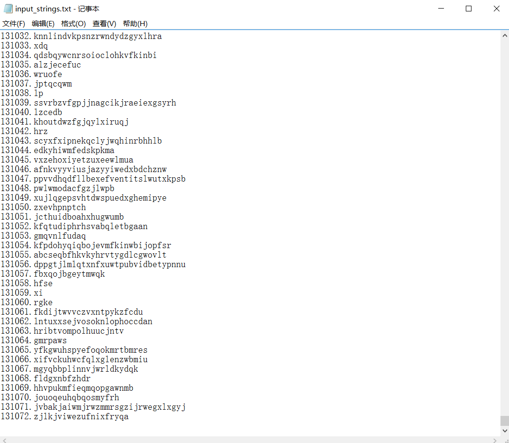
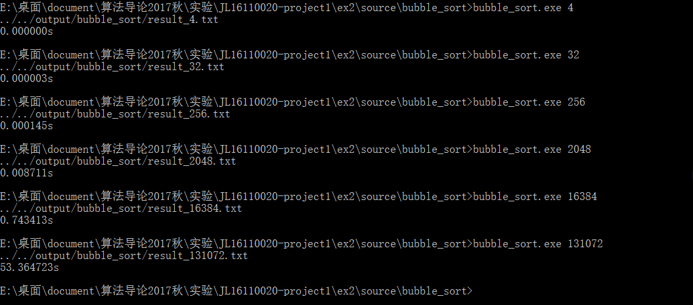
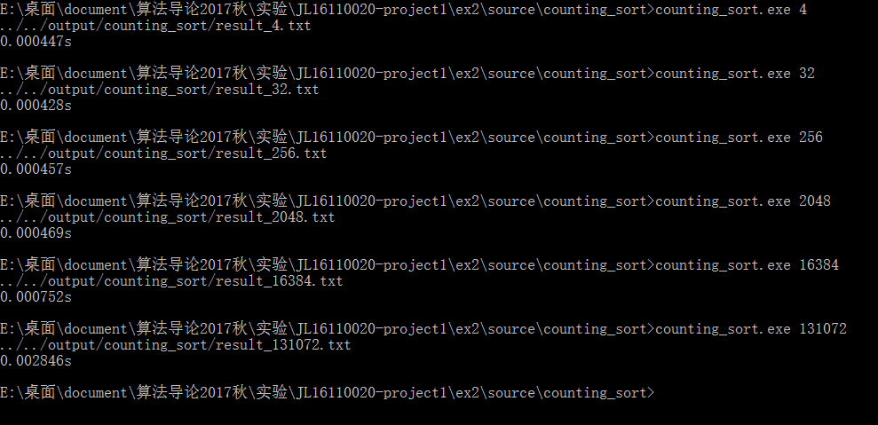
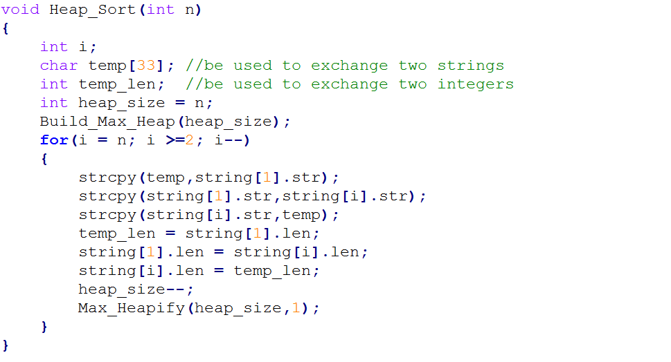
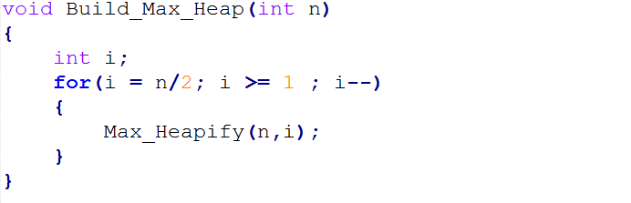
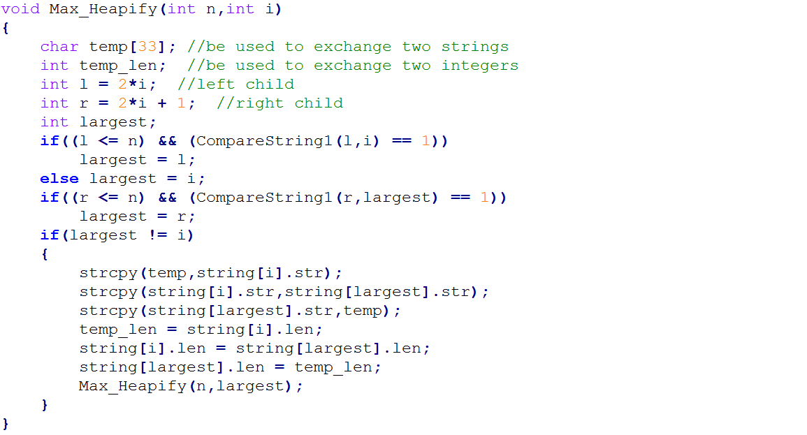
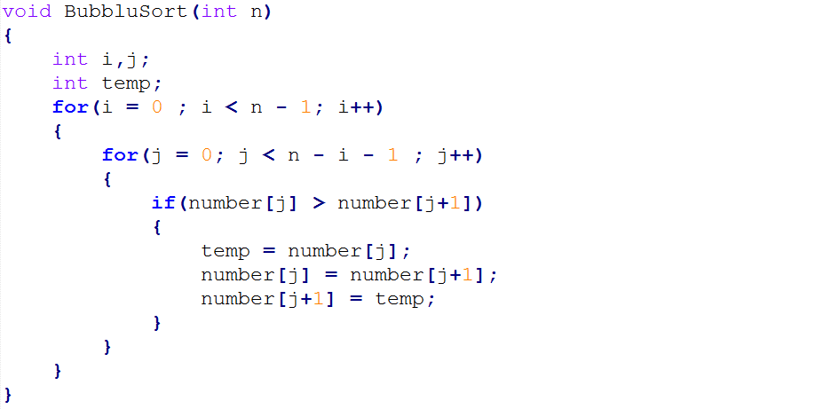
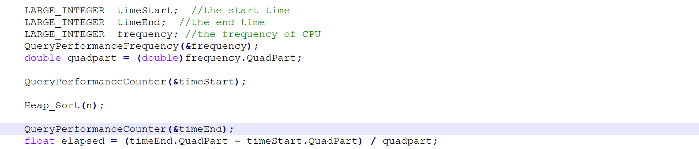

#算法导论实验1、2
>肖文宗 JL16110020

##1.实验要求

实验1：排序 n 个元素，元素为随机生成的长为1..32的字符串（字符串均为英文小写字母），n的取值为：2^2，2^5，2^8，2^11，2^14，2^17；

算法：直接插入排序，堆排序，归并排序，快速排序。

实验2：排序n个元素，元素为随机生成的1到65535之间的整数，n的取值为： 2^2，2^5，2^8，2^11，2^14，2^17 ；

算法：冒泡排序，快速排序，  基数排序，计数排序。

##2.实验环境

- 编辑器：Notepad++
- 编译器：codeblocks
- 解释器：windows10 企业版下的命令行
- 机器内存：8G
- 时钟主频：2.40GHz

##3.实验过程

1. 创建所需的文件夹，按照ppt上的要求即可。
2. 编写生成实验一所需的**随机字符串**的程序。
3. 编写实验一所需的算法。
4. 编写生成实验二所需的**随机数**的程序。
5. 编写实验二所需的算法。
6. 用适当的方法对所得数据进行分析。

##4.实验关键代码截图

1. 生成**随机字符串**。

    在codeblocks下执行produce_strings,生成了131072（2^17)个随机字符串，生成的文件如下：

2. 实验一各个算法的执行。
    - insertion_sort 
    - heap_sort 
    - merge_sort 
    - quick_sort 
3. 生成**随机数**。

    在codeblocks下执行produce_numbers,生成了131072（2^17)个随机数，生成的文件如下：

4. 实验二各个算法的执行。
	- bubble_sort 
	- quick_sort 
	- radix_sort 
	- counting_sort 

5. 关键代码。
	1. 实验一关键代码。
		- insertion_sort 
		- heap_sort   
		- merge_sort  
		- quick_sort  
	2. 实验二关键代码。
		- bubble_sort 
		- quick_sort  
		- radix_sort 
		- counting_sort 

##实验结果、分析
1. 如何记录排序算法所消耗的时间
     
     之前考虑过到底是计算整个程序运行的时间，还是只计算排序算法运行的时间，最后觉得应该只计算算法运行的时间更为合理，所以本次实验我都是只计算排序算法消耗的时间，举一个例子吧：
	
	如图所示，我计算时间都是在排序算法调用前记录一次，排序算法调用后再记录一次。
2. 使用什么工具来记录算法消耗的时间

    首先考虑本次实验需要什么精度的时间测量工具，最开始尝试过clock函数，但是由于其精度是ms，由于现在的计算机能力都比较强，所以对于所有的8个算法，当规模稍小时运行时间都是0，所以专门去查了一下精度更高的函数，得到一张表，如下：
	

	所以我使用精度为微秒的QueryPerformanceCounter函数。
3. 实验所得数据

	
4. 图表分析
	1. 实验一算法分析
		- insertion_sort 
注:因为理论上插入排序是n^2阶的，所以我对输入规模和运行时间都取了对数，分别作为x轴和y轴，这样就变成了线性关系了，观察曲线，大概是线性的。
		- heap_sort 
注:因为理论上堆排序是nlgn阶的，所以我对输入规模取对数，对运行时间除以n，分别作为x轴和y轴，这样就变成了线性关系了，观察曲线，除了第一个数据反常，大概是线性的。
		- merge_sort 
注:因为理论上归并排序是nlgn阶的，所以我对输入规模取对数，对运行时间除以n，分别作为x轴和y轴，这样就变成了线性关系了，观察曲线，大概是线性的。
		- quick_sort 
注:因为理论上快速排序是nlgn阶的，所以我对输入规模取对数，对运行时间除以n，分别作为x轴和y轴，这样就变成了线性关系了，观察曲线，大概是线性的。
	2. 实验二算法分析
		- bubble_sort 
注:因为理论上冒泡排序是n^2阶的，所以我对输入规模和运行时间都取了对数，分别作为x轴和y轴，这样就变成了线性关系了，观察曲线，大概是线性的。
		- quick_sort 
注:因为理论上快速排序是nlgn阶的，所以我对输入规模取对数，对运行时间除以n，分别作为x轴和y轴，这样就变成了线性关系了，观察曲线，大概是线性的。
		- radix_sort 
注:因为理论上基数排序是n阶的，所以我对输入规模和运行时间都取了对数，分别作为x轴和y轴，这样就变成了线性关系了，观察曲线，除了第一个数据反常，大概是线性的。
		- counting_sort 
注:因为理论上计数排序是n阶的，所以我对输入规模和运行时间都取了对数，分别作为x轴和y轴，这样就变成了线性关系了，观察曲线，前面的四个数据都很反常，观察其核心代码：由代码可以看出，只有第二个for循环和第四个for循环是在对待排序数据进行处理，第一个for循环和第三个for循环都是在对一个固定大小（65536）的辅助数组操作，所以这里会花费较多的时间，如果输入数据少则影响更加明显，所以就造成了4~2048规模时，得到的运行时间都差不多。

5. 不同的算法间的比较

	对于实验一，从图表中的得出的结论是：insertion_sort < heap_sort < merge_sort < quick_sort,不过在规模为2的时候，heap_sort的运行时间是大于insertion，其余数据都是按照以上的顺序来的。

	对于实验二，从图表中得出的结论是：n <=32 时，counting_sort < radix_sort < bubble_sort < quick_sort。32 < n <= 256 时，counting_sort < bubble_sort < radix_sort < quick_sort。256 < n < 2048 时，bubble_sort < counting_sort < radix_sort < quick_sort。n > 2048 时，bubble_sort < quick_sort < radix_sort < counting_sort。
##实验心得

1. 以前对文件操作比较陌生，经过这次实验对文件的操作熟练的多了。
2. 对调试程序更加熟悉了，本次实验因为一个BUG专门又重新学习了gdb调试。
3. 对于求算法运行时间，以前只会用精度为ms的clock,本次实验又了解了更加精确的QueryPerformanceCounter函数,其精度可达微秒级，适合本次实验使用。

注：助教若需要验证代码的正确性，只需要打开windows命令行执行对应的exe即可。