# 算法基础上机实验2实验报告

> 肖文宗 JL16110020

## 实验要求

1. 实现求矩阵链乘问题的算法。对n的取值分别为：  5、10、20、30 ，随机生成 n+1 个整数值（ p0、p1、…、pn ）代表矩阵的规模，其中第i 个矩阵(1≤i ≤ n)的规模为pi-1 ×pi ，用动态规划法求出矩阵链乘问题的最优乘法次序，统计算法运行所需时间，画出时间曲线。
2. 实现FFT算法，对n的取值分别为4、16、32、60(注意当n取值不为2的整数幂时的处理方法)，随机生成2n个实数值（a0、a1、…、an-1）和（b0、b1、…、bn-1）分别作为多项式A(x)和B(x)的系数向量，使用FFT计算多项式A(x)与多项式B(x)的乘积，统计算法运行所需时间 ，与普通乘法进行比较，画出时间曲线。

## 实验环境

​	编译环境：VS2017

​	内存：8G

​	主频：2.35GHz

## 实验过程

1. 实验1过程
   1. 编写生成随机数的小程序，生成31个随机数。（生成随机数的小程序放在input文件夹中，produce_numbers.c）生成的随机数如下：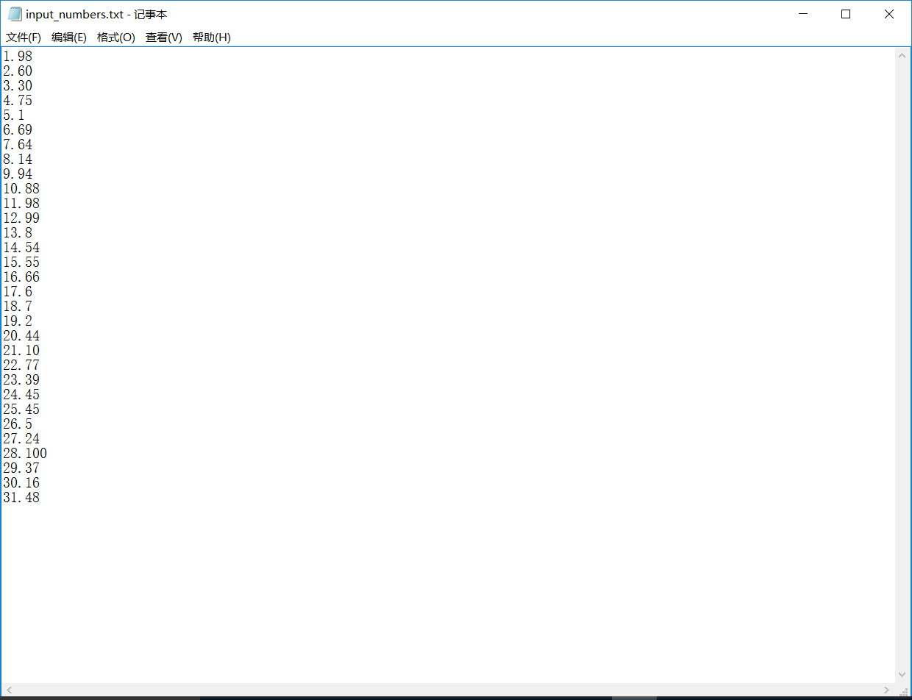
   2. 编写动态规划求解矩阵链乘问题（这个程序在source中，文件名为matrix）。
   3. 对所得数据（运行时间和运行结果，都在output文件夹中）进行分析。
2. 实验2过程。
   1. 编写生成随机数的小程序，生成120个随机数。（生成随机数的小程序放在input文件夹中，produce_numbers.c）生成的随机数如下：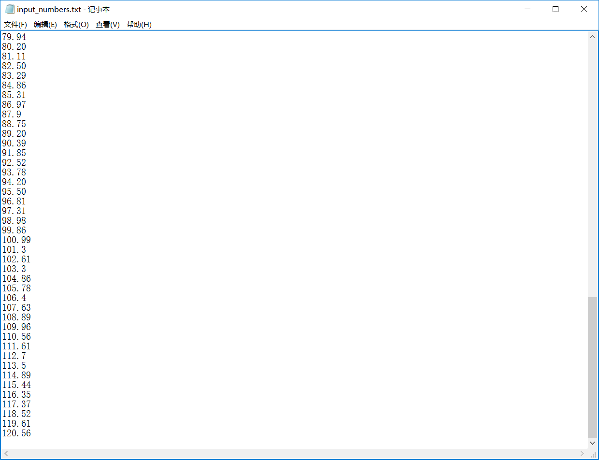
   2. 编写普通乘法求解多项式相乘的程序（这个程序在source中，文件名为mul）。
   3. 编写FFT求解多项式相乘的程序（这个程序在source中，文件名为fft）。
   4. 对所得数据（运行时间和运行结果，都在output文件夹中）进行分析。

## 实验关键代码截图

 1.  实验1关键代码截图。

     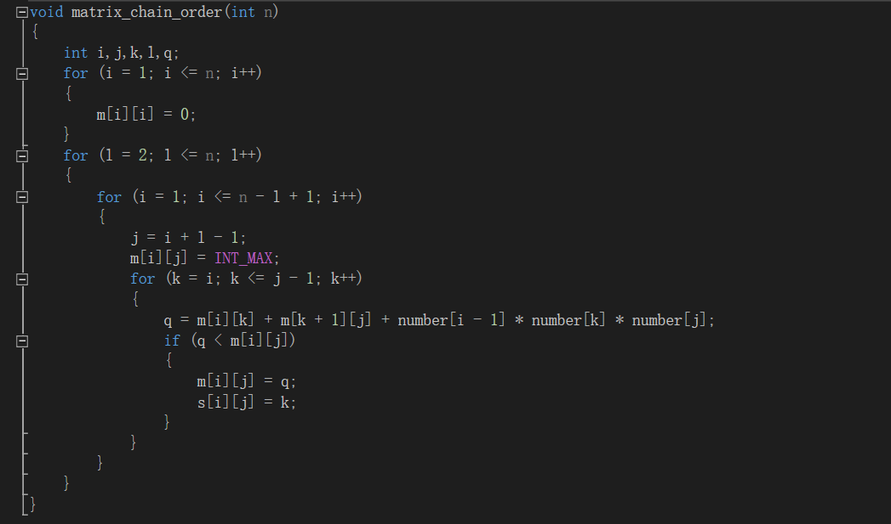

     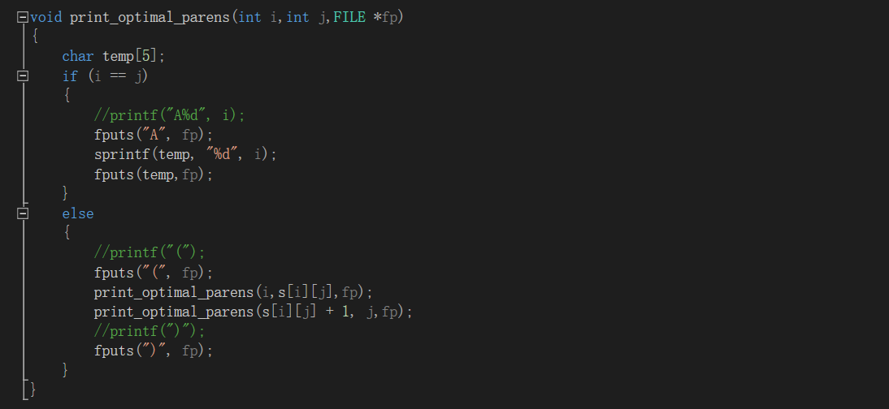

     注：代码和书上一致。

	2. 实验二关键代码截图。

    	1. MUL（普通乘法）

        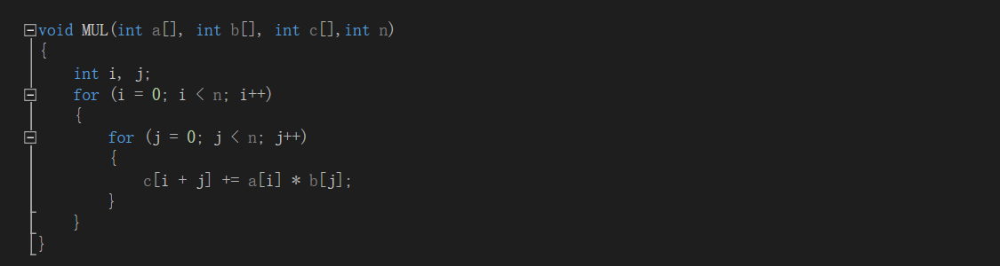

    	2. FFT

        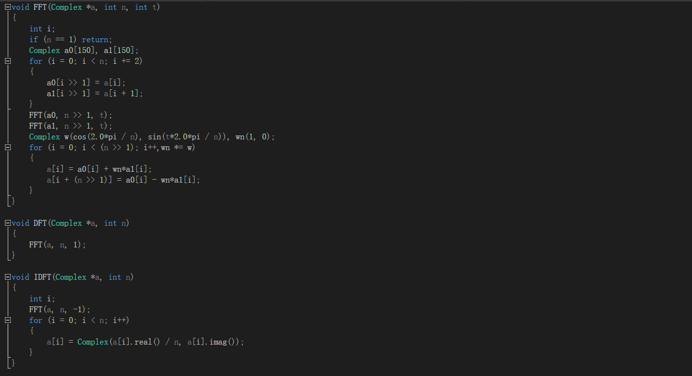

        注：FFT快速傅里叶变换，DFT点值计算，IDFT插值计算，实现和书上基本一致。

## 实验结果、分析

 1.  实验结果

      	1. 实验1结果
          - result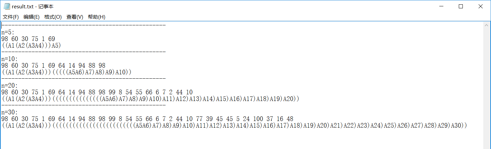
          - time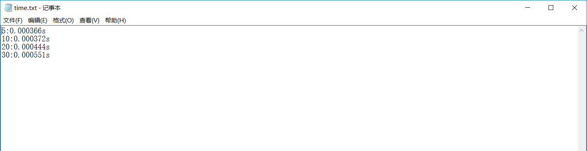
     	2. 实验2结果
         - result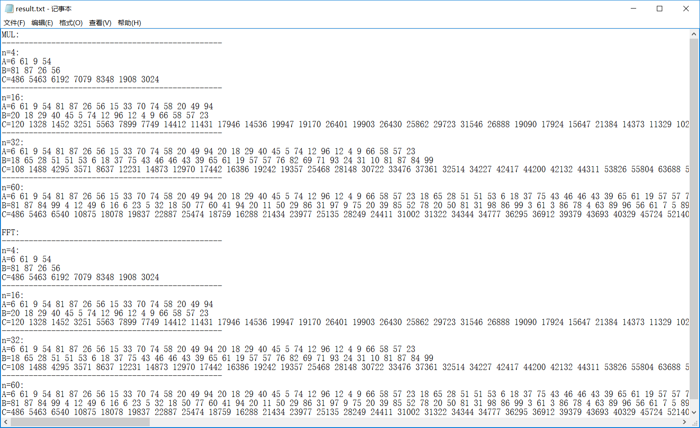
         - time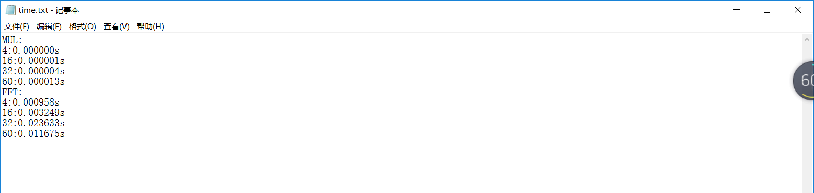

	2. 结果分析

    	1. 实验1结果分析。

        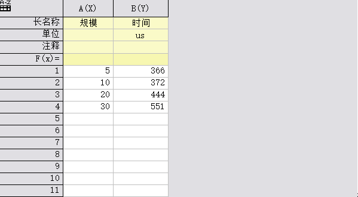

        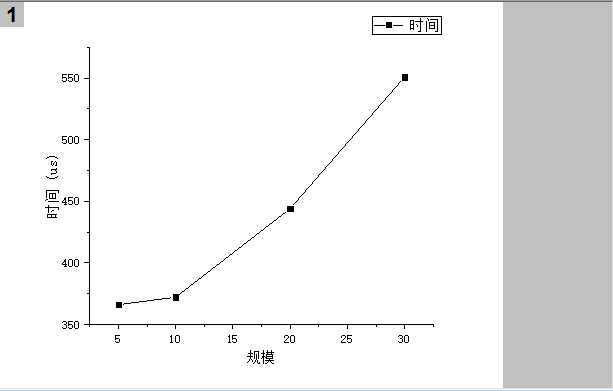

    	2. 实验2结果分析。

        - MUL

          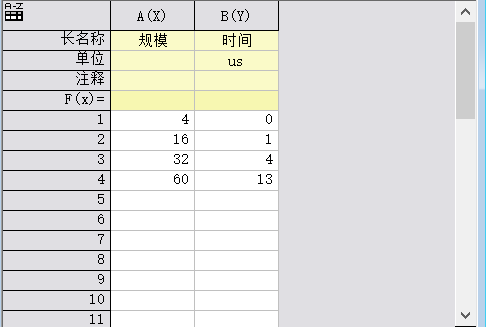

          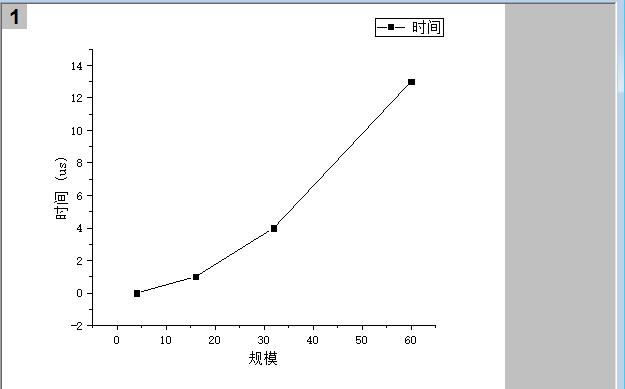	

        - FFT

          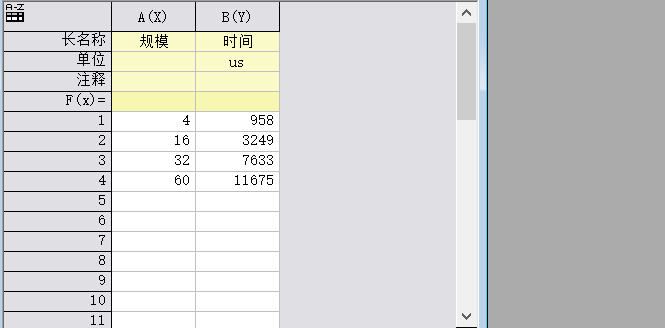

          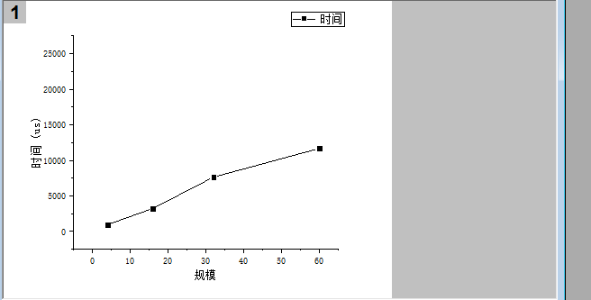

        ​	注：由于实验规模太小，所以普通乘法的性能优于FFT。

## 实验心得

​	数据可视化是实验过程很重要的一环。